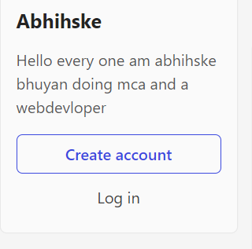
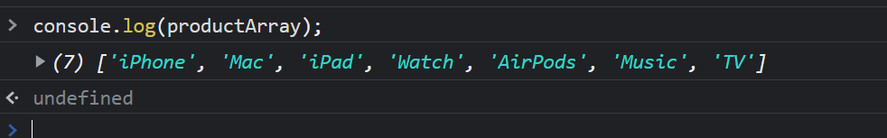
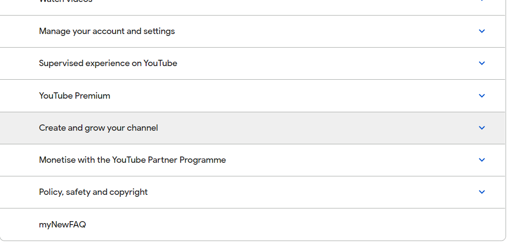
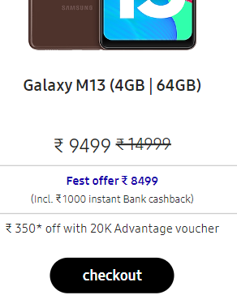
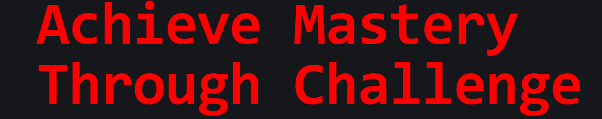
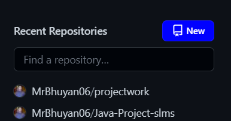
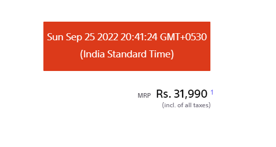
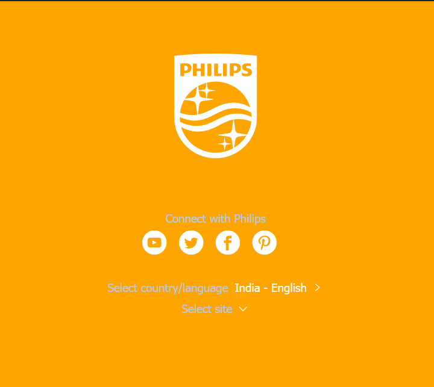

# Dom Manupulation Solution
question 1

code
> document.querySelector(".side-bar .crayons-card  .crayons-subtitle-2").innerText="Abhihske"
> document.querySelector(".side-bar .crayons-card  .color-base-70 ").innerText="Hello every one am abhihske bhuyan doing mca and a webdevloper";

output

question 2

code

> let productArray=[];
let webProductlist=document.querySelectorAll(".as-imagegrid-item-title");
webProductlist.forEach((e) =>
{
    productArray.push(e.innerText.replace("\nSupport",""));
});

console.log(productArray);

outut

question 3

code

> let getlist=document.querySelector(".accordion-homepage");
let section=document.createElement("section");
section.className("parent");
let h3=document.createElement("h3");
h3.textContent("myNewFAQ");
section.appendChild(h3);
getlist.appendChild(section)

output

question4

code

document.getElementsByClassName("one-tel-number").innerText="9090521998"

output
;

question 5
code

> document.getElementsByClassName("diwali-deals-product-sale-btn")[0].setAttribute="checkout"
'checkout'
output

question 6

code

> let search=document.querySelector(".searchinput___19uW0");
search.addEventListener("mouseenter",() =>{
    search.style.bbackgroundColor="red";
});

output

question 8

code:
> let lang=document.querySelectorAll("#SIvCob a");
for(let i in lang)
{
    if(i%2==0)
    {
       lang[i].remove(); 
    }
}

output

;

question 9

code

>let letter=document.querySelectorAll(".content-width-extra-large .display-heading-1")[0];
undefined
letter.style.fontFamily="monospace"
'monospace'
letter.style.color="red"
'red'

output

question 10
code 

> let style=document.querySelectorAll(".login-btn-text")[1]
// undefined
style.addEventListener("mouseover",() =>{style.style.backgroundColor="red"})
// undefined

;
question 11

code

> document.querySelector(".wrapper .icon-logo ").style.background="url(https://ineuron.ai/images/ineuron-logo.png)"

question 12

code
> document.querySelector(".js-repos-container .btn-sm").style.backgroundColor="blue";
output

> ;

question 13

code
> document.querySelector(".wrapper .icon-logo ").style.background="url(https://ineuron.ai/images/ineuron-logo.png)"

output

1

question 14

code
>  document.getElementsByClassName("HotDealsAll__Heading__2fIbe")[0].style.fontSize="100px"

output

15

code
> document.querySelector("#d560823win9b .ps-title").style.textAlign="right";

question 16

code

> document.querySelector(".section-title_title__VEDfK").innerText="Start with Scratch"

output

17

code
> let date=new Date();
> document.querySelectorAll(.buy-btn).innerText=`${date}`

output

question 18

code
> document.querySelector(".p-footer").style.backgroundColor"orange"

output

question 19
code

> let url=document.querySelector(".navbar-brand .logo");
> console.log(url);

question 20
code

>  document.getElementsByClassName("desc")[0].style.color="orange";

output

